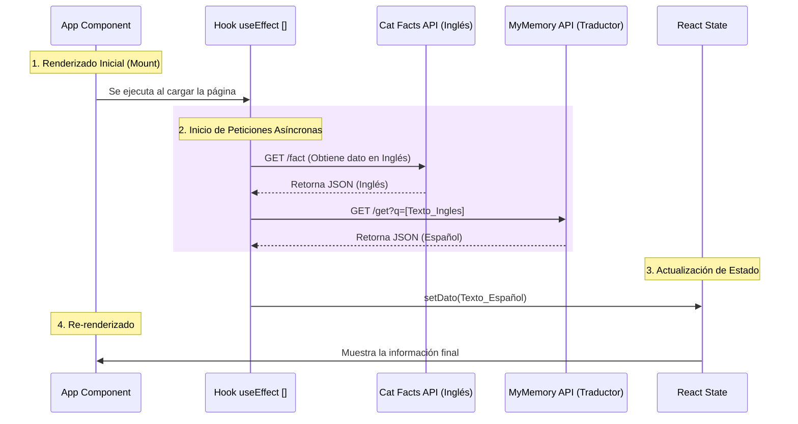

<div align="center">
  
  <h1>Datos Curiosos API</h1>
  
  <p>
    <strong>Una Single Page Application (SPA) para explorar datos curiosos de gatos, traducidos automáticamente al español.</strong>
  </p>

  <p>
    Nota: esta línea se agregó como un cambio sencillo para confirmar el push.
  </p>

  <p>
    
    
    
  </p>
</div>

<hr />

## Características

- **Peticiones Asíncronas**: Integración con `catfact.ninja` usando promesas encadenadas con `fetch`.
- **Traducción Automática**: Consumo de la API de *MyMemory* para convertir resultados de inglés a español en tiempo real.
- **Manejo Estricto de Errores**: Detección inteligente para distinguir entre caídas de red (`TypeError`) y rutas inválidas (errores `HTTP 404`).
- **Diseño Premium**: Interfaz moderna desarrollada completamente con **Tailwind CSS**, complementada con íconos vectoriales de **Lucide React**.

## Tecnologías Utilizadas

* **React 18** (Desarrollo basado en Hooks: `useState`, `useEffect`)
* **Vite** (Empaquetador ultrarrápido y Hot Module Replacement)
* **Tailwind CSS v3** (Estilos orientados a utilidades)
* **Lucide React** (Librería de íconos SVG)

## Instalación y Uso

1. **Clonar el repositorio**
```bash
git clone https://github.com/tu-usuario/catfacts.git
cd catfacts
```

2. **Instalar las dependencias**
```bash
npm install
```

3. **Iniciar el servidor de desarrollo**
```bash
npm run dev
```

4. **Visualizar la aplicación**
Abre [http://localhost:5173](http://localhost:5173) en tu navegador.

## Arquitectura y Ciclo de Vida: El Hook `useEffect`

La aplicación utiliza el hook `useEffect` en el componente principal (`App.jsx`) para inicializar la extracción de datos desde las APIs externas. Al proveer un array de dependencias vacío `[]`, garantizamos que el bloque de código interno se ejecute de manera estricta durante la fase de **Montaje (Mount)**. Esto previene re-renderizados infinitos y optimiza las peticiones de red.

### Flujo de Ejecución del Ciclo de Vida



## Manejo de Errores Estricto

El bloque `try...catch` implementado está diseñado a prueba de fallos:
- Si se modifica la URL base simulando una caída de conexión (ej. un dominio falso), el sistema atrapa un error de tipo `TypeError` y notifica al usuario final sobre un problema de conectividad de red.
- Si se modifica el *endpoint* de la API (ej. `/fact` a `/datos`), la petición retorna un código de estado `404`. El flujo intercepta explícitamente este código para renderizar una alerta de ruta inválida.

---

<div align="center">
  <h3>Participantes</h3>
  <p><strong>Victoria González</strong> y <strong>Miguel Lagunes</strong></p>
  <br/>
  <i>Proyecto construido con React para evaluación académica.</i>
</div>
